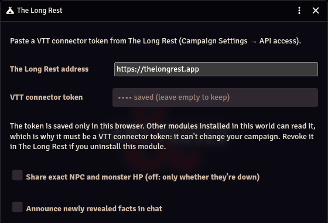
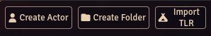
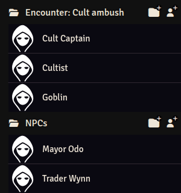
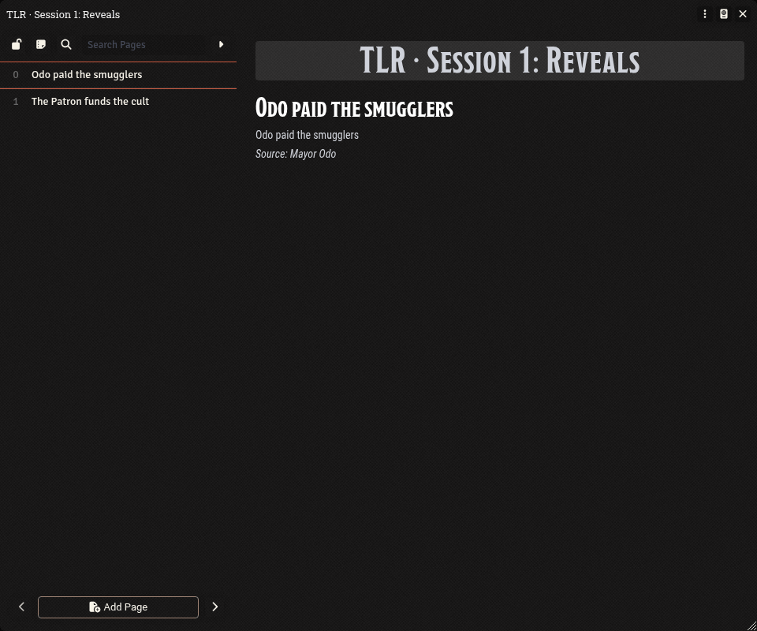

# The Long Rest for Foundry VTT

Bring your [The Long Rest](https://thelongrest.app) session prep into Foundry (NPCs, encounter monsters,
revealed facts), and send what happens at the table back to your campaign: the fight, HP, rolls and
conditions.

Needs Foundry **v14** (14.367 or later) with the **dnd5e 6.0** system. On anything else the module turns
itself off and tells the GM why.

## Install

In Foundry's setup screen: **Add-on Modules → Install Module**, and paste this manifest URL:

```
https://github.com/bpuhnk/thelongrest-foundry/releases/latest/download/module.json
```

Then enable **The Long Rest** in your world (**Game Settings → Manage Modules**).

## Connect

1. In The Long Rest: **Campaign Settings → API access**. Create a token with the **VTT connector**
   access level, and copy it (it's shown once).
2. In Foundry, as the GM: **Game Settings → Configure Settings → The Long Rest → Connect**. Paste the
   token and press **Test connection**.

The token is kept **only in this browser**; it isn't stored in the world or sent to your players.
Other modules in the world *can* read it, which is why the module only accepts a VTT connector token:
it can read what your players may see and send table state, but it can't change your campaign.
Co-GMs who should send table state connect in their own browser; only the active GM ever sends.

## Use

- **Import session prep** (Actors directory, or the Connect window): a folder with the session's NPCs,
  one folder of ready-to-drag monsters per prepared encounter, and a journal of the facts your players
  have learned. Importing again updates in place.
- **During play** the active GM's Foundry sends The Long Rest the fight (round, turn order, who's down,
  conditions), player characters' HP and public rolls, so its AI, DM Screen and recaps know too.
- **Reveals** you make in The Long Rest appear in the session's journal within about 10 seconds while
  the session is running. Turn on **Announce newly revealed facts in chat** to also post them to your players.

**Never sent from Foundry:** hidden combatants (even on their turn), whispered, blind and
hidden-creature rolls, effects on hidden creatures, and NPC HP unless you turn on
**Share exact NPC and monster HP**. **Never sent to Foundry:** anything your players can't see in The Long Rest.
Nothing flows back into your fights, HP or scenes.

To remove it: revoke the token in The Long Rest, then disable the module. Imported actors and journals
stay as ordinary Foundry documents.

## What it looks like



*Connect: paste a VTT connector token and click **Test connection** (it saves too).*



*Import TLR in the Actors directory brings in the running session's prep.*



*An imported session: one folder per encounter, plus the NPCs your players may see.*



*The reveals journal: one page per revealed fact, updated while the session runs.*

## Development

```bash
npm install
npm test          # unit tests (no Foundry needed)
npm run build     # dist/ + module.zip
npm run leak-scan # nothing private in the tree (add -- --history for all commits)
```

Releases: bump `version` in `package.json` and add a `## <version>` section to `CHANGELOG.md`. After review,
`scripts/publish.mjs` publishes the reviewed tree as ONE commit (dry run by default; `--verify` runs the
leak scan, tests, build and release check on that commit in isolation; `--push` needs a named public
remote and `--reviewed-tree <sha>`). The public release workflow then builds `module.json` + `module.zip`
from the tag. A pre-push hook (`.githooks/`, enabled by `npm install`) runs the leak scan before every push.

The committed scanner (`scripts/leak-scan.mjs`) carries only generic rules (tokens, keys, credentials,
emails, home-directory paths). Project-specific patterns live in a gitignored `.leak-patterns.local.json`
(`[{ "pattern", "flags", "label" }]`, or a path in `LEAK_PATTERNS_FILE`). The pre-push hook and
`scripts/publish.mjs` refuse to run without it.

## Licence

MIT: see [LICENSE](LICENSE).
